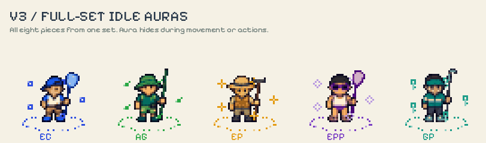

# Pocket Coast · complete v3 asset export

The v3 artwork exported in the v4 format: individual native PNGs, seeded cosmetic variants, atlases, labelled contact sheets, JSON mappings and a reproducible exporter. The earlier 23-pool map generator is bundled as `world/`. This folder is isolated from the running app.

Start with the [visual catalog](exports/previews/00-overview.png), [animated walk preview](animations/previews/walk-sets.gif) or [complete download](pocket-coast-v3-complete.zip). All file paths in `exports/manifest.json` resolve relative to `exports/`, except source-art paths, which resolve from this pack's root.

## Animation designs

The pack now also includes **347 animation clips, 2,028 PNG frames, 347 animation atlases and 10 animated GIF previews**. The animation registry is `animations/manifest.json`, separate from the static catalog registry.

- Full-set idle auras for all five sets, with back/front layers. A complete matching eight-piece set is required. Auras hide during movement, actions, defeat or invisibility.
- Monster rarity auras from common to legendary, also hidden during movement and actions.
- Four-direction idle, walk, cast, hit, victory, spawn, defeat, escape and crouch clips for all five outfits.
- Idle, attack, hit, spawn and defeat for all ten base monsters.
- Idle/swim loops for all five species and all 23 individual pool creatures.
- Effects and impact timelines for the seven current combat moves; additional hit, healing, spawn, reward, emote, loot, service and water animations.



[Rarity auras](animations/previews/rarity-auras.gif) · [Idle/movement rule](animations/previews/aura-idle-rule.gif) · [Combat actions](animations/previews/combat-actions.gif) · [Monster motion](animations/previews/monster-motion.gif) · [Pool creatures](animations/previews/pool-creatures.gif) · [Loot](animations/previews/loot.gif) · [Service](animations/previews/pool-service.gif) · [Water](animations/previews/water-loops.gif)

These are procedural motion studies derived from v3 art. Walking moves the lower legs and body; other clips combine pixel poses with motion offsets and effects. They are not newly illustrated animation drawings for every frame. See [animation documentation](animations/README.md) for playback, timing, activation rules and coverage.

## Included

| Collection | Count | Native size |
|---|---:|---|
| Equipment base designs | 40 | 16 × 16 |
| Equipment across six rarities | 240 | 16 × 16 |
| Cursed equipment, uncommon through legendary | 200 | 16 × 16 |
| Seeded equipment-instance examples | 40 | 16 × 16 |
| Five outfits in four directions | 20 | 24 × 32 |
| Ten avatar colour presets in four directions | 40 | 24 × 32 |
| Residence creature species | 5 | 24 × 24 |
| Individually seeded pool creatures | 23 | 24 × 24 |
| Full monster bestiary | 10 | 28 × 24 |
| Monsters across six rarity tiers | 60 | 28 × 24 |
| Pool-specific monster appearances, 23 × 10 | 230 | 28 × 24 |
| Crafting resources | 10 | 16 × 16 |
| Support icon bases | 10 | 16 × 16 |
| Loot crates across six rarities | 6 | 16 × 16 |
| Seven action icons | 7 | 16 × 16 |
| Atlases with JSON frame rectangles | 23 | Varies |
| Seeded pool maps with layout JSON | 23 | 256 × 192 |
| Original v3 overworld and depot backgrounds, normalized | 2 | 256 × 192 |

There are **989 manifest entries**, including bases, derived variants, reusable support art, atlases and maps. This is not a claim of 989 independently drawn designs. All native outputs have binary alpha, with fully transparent or fully opaque pixels. Background maps are opaque.

## What is original v3 art

The five original v3 PNG sheets are retained unchanged in `source-art/`. Characters, base equipment and the original five companions and three monsters are sliced from those actual images. The other seven monsters and the resource/support sheet were made with the built-in ImageGen tool using v3 as their style reference. Exact prompts are in `prompts/`.

The exporter follows transparent gutters rather than assuming a perfectly uniform generated grid. It records the source rectangles in `sources/extraction-manifest.json`, removes faint alpha fringes, reduces to the native canvas, limits colours and makes alpha binary. The rake's small teeth are reinforced after reduction so the tool remains identifiable. `exports/large/` contains 95 individually cropped larger versions, with faint fringes removed; the unchanged full sheets remain in `source-art/`.

The map generator uses the earlier v4 native tile renderer. Its maps are fictional property layouts, not reconstructions of the real residences. The two additional v3 scene backgrounds are normalized from the generated environment images; they do not have authored collision grids. Use the 23 seeded maps where navigation data is needed.

## Sets, slots and directions

Sets retain the game IDs: EC, AG, EP, EPP and GP. Equipment slots are `head`, `body`, `legs`, `feet`, `charm`, `pole`, `robot`, `brush`. The manifest maps them to the game's French slot names. `catalog.json` contains the current item names, rarity names, monster descriptions and resource labels.

The base character atlas order is **south, east, west, north**. It contains static idle views; motion frames are in the separate animation registry. Feet anchors are measured from the actual feet rather than the tool-inclusive image centre. Whole-outfit sprites are exported; composable clothing layers and alternate hairstyle geometry are not included.

V3 creature names are Écume, Oyatin, Pignotte, Bouémitte and Clapot. Bind species by residence ID rather than display name: the current app's text uses Gouémitte and Glapot for the last two in some places.

## Rarity and curses

The six rarity colours and order come from the current game catalog: grey common, green uncommon, blue rare, purple very rare, amber epic and red legendary. Material and set colours remain recognisable. A small corner mark and one-to-six bottom notches carry rarity. Cursed variants add a purple mark; common items have no cursed version.

These are visual exports. The scripts do not roll item stats, change affixes, alter loot rates or decide which monsters spawn. Every pool has an exported appearance for each monster so gameplay can choose the relevant one independently.

## Seeds

Version: `pocket-coast-v3-assets-1`. Cosmetic seeds use UTF-8 FNV-1a over `version | namespace | identity | revision`. Pool creature identity uses its pool ID; monster identity uses `pool ID | monster ID`; equipment uses a stable loot-instance identity. Seeds alter controlled body colour and lower-body markings, preserving the silhouette. Avatar presets demonstrate skin-palette changes; some back views can share identical pixels where no recoloured skin is visible.

Changing the revision gives a new cosmetic roll. Keep the revision once approved. A generator or source-art change should use a new version: a seed alone cannot preserve an asset across arbitrary art or algorithm changes.

```python
import sys
from PIL import Image
sys.path.insert(0, 'sources')
from pixel_export import cosmetic_variant, equipment_variant, avatar_variant

base = Image.open('exports/native/species/species-EC.png').convert('RGBA')
creature, metadata = cosmetic_variant(base, 'EC-2', revision=0)

cap = Image.open('exports/native/equipment-base/EC-head.png').convert('RGBA')
item, metadata = equipment_variant(cap, 'EC-head|loot-123', 'rare', revision=0)

keeper = Image.open('exports/native/characters/EC-south.png').convert('RGBA')
avatar, metadata = avatar_variant(keeper, 'keeper-01', revision=0)
```

Apply the same avatar identity and revision to all four directions. Image operations are local and require no image-generation API access. The world module retains its separate layout seed/version and never rerolls because a cosmetic revision changes.

## Rebuild and verify

From this folder, install the pinned Pillow and NumPy versions from `requirements.txt`, then run:

```sh
python3 build.py
python3 verify.py
python3 animations/build.py
python3 animations/previews.py
python3 animations/verify.py
python3 package.py
```

To explore new cosmetic rolls for the whole export, use `python3 build.py --revision 1`. This rewrites generated outputs; copy the pack or use a separate folder if retaining the reviewed revision-zero exports. Native dimensions and binary alpha are checked automatically. Verification also checks all catalog combinations, hashes, atlas rectangles against individual assets, source-crop boundaries, distinct pool variants and byte-identical rebuilding. Results are in `qa/verification.json`.

The included world module can independently rebuild its 23 maps with `node world/export.mjs` and validate them with `node world/verify.mjs`. Its verification covers 575 generated layouts.

## Use later

`exports/manifest.json` maps stable IDs to images, seeds, source crops, variants and atlas rectangles. Draw native assets at integer coordinates with image smoothing disabled. Use nearest-neighbour scaling for enlarged display. Palette reduction preserves the broad v3 direction but necessarily loses some detail at 16–32 pixels; larger source slices are included for further art refinement.

The static catalog and animation designs have been exported and checked. Wiring these files and playback rules into the live game is separate integration work. No app data, game balance or live app files are changed by this pack.
