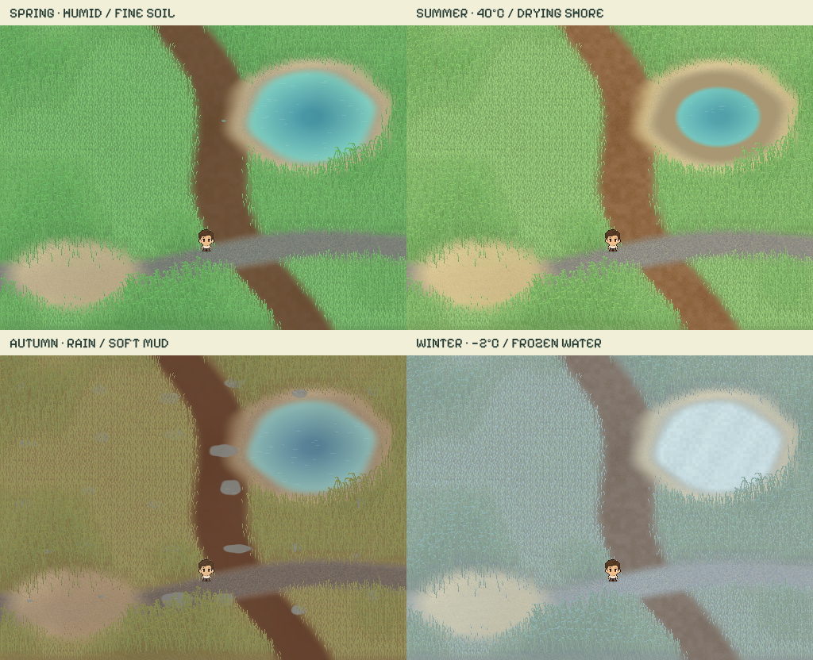
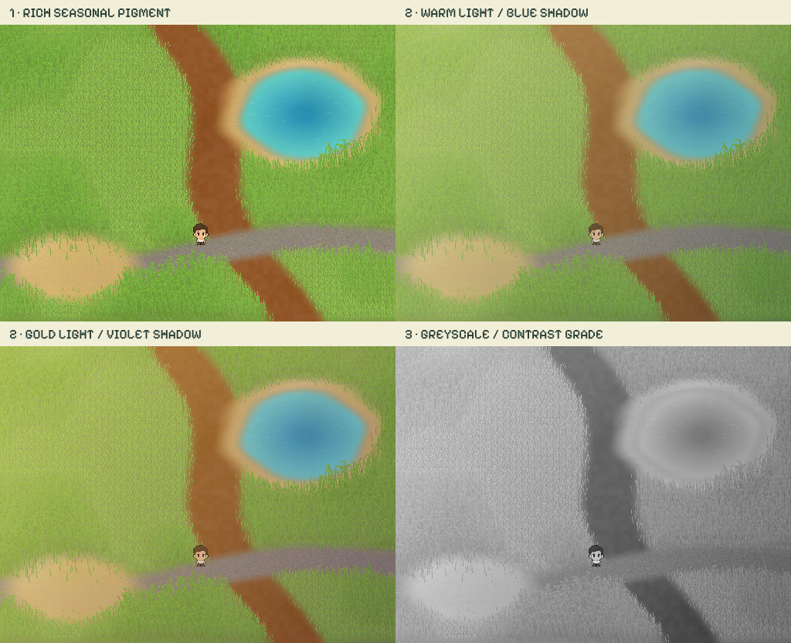
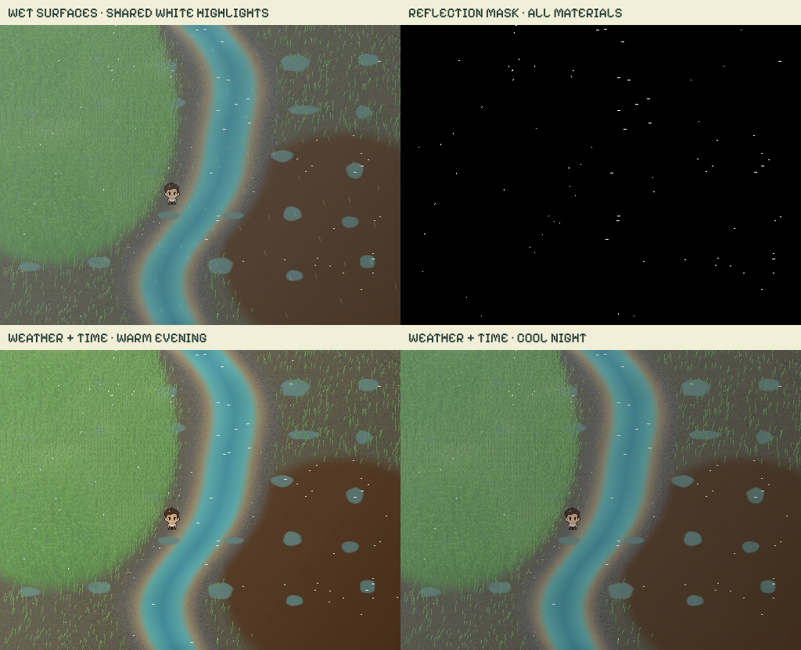
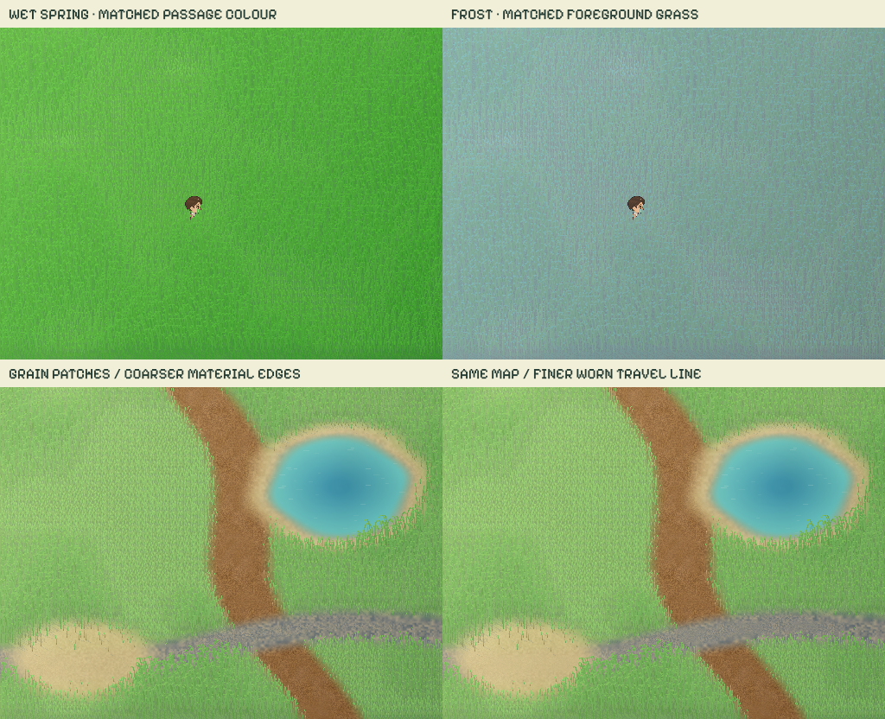

# Surface lab

Interactive base-material and weather studies for Pocket Coast. Open
`http://127.0.0.1:8015/art/surface-lab/` while serving the repository root.

[Saved looks](presets/README.md) keep named settings from the live lab, one
capture at a time.

The surfaces are continuous colour and grain fields. Earth and gravel contain
no baked-in pebbles or rock geometry; separate decorative rock artwork can be
layered on later. The lab loads keeper art and renderer helpers, but never
loads Store, Sync or Game or writes maintenance/player records.

## Explore

**Blend** shows all five materials. **Grass, Sand, Earth, Gravel, Water** isolate
one. The Map selector offers **Rain garden**, **Dune pond** and **Gravel stream**.
All three maps have soft material transitions and shallow, walkable water.

- Grass keeps coherent 10–40px patches averaging approximately 20px.
- Grain scale now spans **0.25×–4×**. At 1×, sand is 0.5px, fine earth
  0.25px and small gravel 0.75px. The minimum gives earth 0.0625px and
  gravel 0.1875px equivalent texture scales before regional variation. Unresolved particles average
  into colour instead of becoming visible rock-sized pixels.
- **Grain regions & paths** adds seeded, smoothly varying sizes, coarser
  material boundaries and finer, worn travel lines. Repeated footsteps build
  wear; it outlasts the short footprint animation and slowly recovers, faster
  in rain. **Reset wear** clears this local history.
- Grass redrawn over the keeper uses the same seasonal, wet and frost colours
  as the background grass, before the common lighting and final grade. The
  keeper preview also uses its neutral artwork instead of an extra fixed sun tint.
- Wind bends rooted grass, transports dry sand and slowly carries fine earth
  grains. Gravel stays fixed in wind and only displaces underfoot. Wetness restrains
  grains, suppresses dust and turns fine earth from dry aggregates into smooth mud.
- Sand's colour shading and fine grains travel together along the wind arrow.
  Gusts change speed without reversing direction. Turning the wind changes
  the next displacement without rotating or jumping the existing texture.
- Steps stir water, part grass and recombine/displace local grain colours.
  Contact marks and shading settle back gradually; no stones are spawned.
- Rain soaks into materials at different rates. Damp soil darkens and becomes
  more cohesive; low spots fill with small puddles. Rain and steps make ripples.
- **Dry out** increases drying. Puddles recede and loose dust becomes available
  again. **Heat · 40°C** also recedes shallow water, exposing its sandy bed;
  rain refills it. **Frost · −2°C** cools water before ice grows, suppressing
  flow and splashes. Warm air thaws it.
- The **Weather clock** accelerates moisture and thermal states, not walking or the
  fluid integration. These are deliberately fast art-simulation times.
- **Colour & light** contains palettes, greyscale/black-and-white, contrast,
  shading, and a **water flow vector** overlay for inspecting the solver.
  Select any two seasons and blend between their surface, highlight and shadow
  palettes. Summer → winter and spring → autumn both work; colour changes
  preserve map layout, moisture, flow and walking state.
- **Play sequence** stages growth, contact and recovery. Pause or scrub it;
  the same starting weather and fixed replay steps make scrubbing reproducible.
- Tap to walk, hold arrows/WASD, or use Auto walk. Water slows the keeper and
  masks the feet for wading. Manual movement exits the staged sequence.

Reduced motion stills ambient animation. A manually played or scrubbed sequence
can expose its animation stages. Old documentation preview URLs redirect here.

The same layout under four seasonal/weather states (0.5× grain scale):



## Pool study

[`pool.html`](pool.html) puts a real pool map on the living ground. Pick any of
the 23 pools; the map's grass, sand paths, the gravel apron around the pump
shed, the earth under trees and the forest edge of Grand Piquey become the lab's
continuous materials, and the terrace, basin, trees, shed and props come from
`PoolMaps`, the living world and the zone kit. Villas are a provisional flat
roof. The basin keeps the game's four water states.

- `js/pool-surface.js` turns a `PoolMaps` layout into a `SurfaceMaps` sampler:
  each map cell is classed grass, sand, earth, gravel, hard (terrace) or solid
  (basin, buildings); signed distance fields on a 4 px grid give soft edges,
  and hard/solid ground fades the field out so the map's own art shows through.
  `SurfaceMaps.register(id, sampler)` accepts such external layouts.
- The field paints in three passes so the scene can sort actors and scenery
  between them: `paintBase` (ground, water, rooted grass), `paintActor`
  (shadow, actor, blades over the feet) and `paintFront` (haze, light, rain,
  reflections). `paint` still composes all three for this lab.
- The living world's `Scene` takes `{ surface: true }` to skip its own lawn
  and meadow, a `sprite(prop)` override, and exposes `paintScenery` and
  `paintSky` separately.
- Budget options on the field, off by default so the lab is unchanged:
  `grainRes` (grain texture pixels per scene pixel, 2 here, 1 in the study),
  `grainRate` and `grassRate` (Hz caps on grain re-renders and grass layer
  rebuilds), `spriteCacheSize` / `spriteCacheBytes`. The study's URL takes
  `?res=2&grain=0&grass=0` to compare with the uncapped lab look. In the
  headless test renderer these cut a frame from about 100 ms to 20 ms with no
  visible change; a phone should be measured on the device.
- Objects sit in the grass rather than on it. The scene reads each prop's
  contact line from the opaque bottom rows of its own sprite (`Scene.contact`),
  and after drawing the prop the field redraws the blades rooted in front of
  that line over its base, the same pass the keeper's feet get. Blades right
  at a base also grow shorter (`Field.settle`). Nothing is per item;
  `?blend=0` on the study URL shows the difference.
- Weather presets (sec, brise, pluie, tempête, gel) and time of day; "Météo
  Lacanau" applies the app's cached Open-Meteo record through `SurfaceClimate`.
- Worn paths persist per pool in `localStorage` under `lp-surface-study.wear.*`
  (study only, 3 KB each). "Effacer l'usure" clears them.

## Three colour layers

**Colour & light** has three independently adjustable stages:

1. **Seasonal pigment** blends two seasonal material palettes. Richness controls
   their chroma before illumination; the default is 125%. Grass, soil, gravel,
   sand and water keep their distinct colours and fine texture.
2. **Light & shadow** adds a separate opposing-colour pair: neutral, sun/blue,
   sky/warm, gold/violet, or rose/teal. Both colours are editable. Light blend,
   lighting saturation and cast-shadow density can be adjusted independently.
   Setting lighting saturation to zero leaves seasonal pigment colourful.
3. **Final grade** applies finishing tint, saturation, exposure and contrast to
   the complete scene, including the keeper. Greyscale and black/white views
   inspect tonal separation after pigment and lighting have been combined.

Lighting uses two cached 128×96 colour gradients (98,304 decoded bytes) with
multiply/screen compositing, plus a matching cast-shadow tint. It is an art
lighting pass, not a geometry-based light-transport solver. Changing it does
not rebuild the underlying pigment textures or alter weather, terrain or flow.
The final grade uses the browser's canvas presentation filter, adding no
per-frame pixel readback. Pigment changes rebuild bounded cached textures only
when a control settles.



## Surface reflections, adaptive colour and sound

**Light & shadow → Surface reflections** controls a shared achromatic highlight
pass. Water, grass, sand, earth, gravel and the keeper each have a reflectivity
slider, alongside overall strength, wet-sheen gain and roughness. Wetter surfaces
produce more sheen; material roughness changes the directional response. Sand
and soil highlights follow their transport, grass glints follow the blade curve,
and gravel stays still until disturbed. Frozen water and reduced-motion mode
keep highlights still. Grass and the keeper occlude reflections behind them.

**Final grade → Reflection mask** shows only active white highlights on black.
It bypasses colour/exposure grading. The ordinary **Black & white** view still
thresholds the complete scene's brightness, which includes bright banks and
skin as well as glints. The white reflection source is graded with the scene in
normal colour view; a finishing tint can therefore warm or cool its appearance.

This is an art model with a material lobe and roughness, not measured optical
reflectance or physically based ray tracing. It uses 3,072 fixed ground sites,
at most 1,024 grass candidates and three reusable 512×384 buffers (2.25 MiB,
excluding JS object overhead). No per-frame pixel readback or growing particle
pool is used. Inactive map entries still retain only the small state snapshot.

**Adaptive weather & time** can blend a weather/time target into light colour,
shadow colour, contrast, exposure and saturation. Manual remains the default.
Your manual controls remain the base values; changing the driver back to Manual
restores them. Weather + study time uses the hour slider. Saved weather + time
uses the existing read-only weather bridge and the observation's local time in
Europe/Paris, including the browser's daylight-saving conversion. Missing dates
leave the manual grade in place. The day/evening/night curves are art direction,
not an astronomical sunrise or a weather forecast.

**Sound of the map** uses the supplied v5 sound engine and catalogue. Explicit
**Enable sound** starts the single audio context. Music, ambience and effects
have separate levels; automatic music follows the study/adaptive hour, while
wind, water and rain follow the active map. Footsteps select soft-ground, stone
or splash cues, with grass rustle. Scrubbing the sequence does not emit steps.
Mute removes active voices/beds and suspends the context; hiding pauses it and
leaving disposes it. Nothing autoplays on load or writes sound preferences into
the app's data. The runtime uses one shared two-second noise buffer and caps
transient voices at 32. The supplied WAV/MP3 exports are not preloaded.



## Mathematical models

The user's freedom-to-constraint idea is expressed as **grain correlation
scale, mobility, drag, cohesion and yield threshold**. These are relative art
parameters, not a literal count of mechanical degrees of freedom or measured
material constants.

| Material | Base grain | Mobility | Drag | Constraint / model |
| --- | ---: | ---: | ---: | --- |
| Water | Continuous | 1.0 | 0.35 | 2D incompressible velocity field |
| Grass | Rooted blades | 0.70 | 17 | Damped spring, stiffness 82; root position fixed |
| Sand | 0.5px | 0.65 | 3.5 | Low-cohesion granular transport |
| Earth | 0.25px | 0.09 | 12 | Fine soil with separate dry aggregates / saturated mud |
| Gravel | 0.75px | 0.025 | 30 | Friction; wind transport disabled, local contact only |

### Soil reference and units

The texture sizes above are **rendering scales**, not millimetres. Earth is a
mixture, not a single particle-size class. A future measured soil input should
use particle-size distribution and the percentages of sand, silt and clay;
this is how the [NRCS soil texture calculator](https://www.nrcs.usda.gov/resources/education-and-teaching-materials/soil-texture-calculator)
classifies texture. [USGS uses ppm for sediment concentration](https://water.usgs.gov/water-resources/memos/memo.php?id=992),
not particle diameter.

Grain size alone does not calibrate transport: the lab retains separate drag,
yield and wet-cohesion parameters. The requested water → sand → earth → gravel
response is a designed visual gradient. It is not a measured soil-erosion model.

### Water

`fluid.js` evolves horizontal velocity on a masked 64×48 grid: external forces,
implicit viscosity, pressure projection, semi-Lagrangian advection, then another
projection. It follows the operator-splitting approach in
[Jos Stam, *Real-Time Fluid Dynamics for Games*](https://www.dgp.toronto.edu/public_user/stam/reality/Research/pdf/GDC03.pdf).
The intended equations are
`du/dt + (u·∇)u = −∇p + ν∇²u + f − γu`, with `∇·u ≈ 0`.

Wind and footsteps supply forces. The solved velocity advects a passive colour
field used by the water renderer. Pressure
uses 24 relaxation iterations. Solid mask cells retain zero velocity. The
solver arrays use about 126 KB; cell-space units keep tuning explicit.

This is an approximate 2D visual solver, not a 3D free-surface water model.
Surface ripples, wading, rain accumulation and low-spot filling are separate
models. Puddles smaller than a solver cell mainly use the ripple layer.

### Rooted and granular materials

Grass integrates a damped spring toward wind/contact targets. Longer blades
are more compliant; wet blades have greater damping. Roots never advect.

Sand and earth wind transport follow a yield threshold, mobility and wet cohesion:
`mobility × max(force − yield − wet·cohesion·0.4, 0) × max(1 − 1.25·wet, 0)²`.
Velocity is `22 × wind × transport × positiveGust × windDirection`, in world
pixels per second. Its integral carries periodic textures; dry earth moves
about 13% as far as sand at 90% wind. Gravel has an explicit no-wind gate.
Sand shading is sampled at these same transported coordinates, with no separate
back-and-forth phase. Two-times-resolution grain layers preserve half-pixel sand
and quantize movement to half a world pixel, avoiding resampling flicker.

Contact displacement has an impulse rise, drag and a sustained pressure patch,
followed by controlled recovery. Foot pressure can move gravel despite its
wind lock; only the small contact area changes. These are continuous visual
approximations, not a discrete element simulation of individual grains.

Weather retains separate moisture states for grass, sand, earth and gravel.
Rain supplies moisture; temperature, humidity, sun, wind and drainage control
drying. The evaporation multiplier is
`exp((temperatureC − 18) × 0.035) × (1 − relativeHumidity) / 0.45`.
It is a tunable visual response, not a meteorological evaporation formula.
[USGS describes the roles of temperature and humidity in evaporation](https://www.usgs.gov/water-science-school/science/evaporation-and-water-cycle?page=1).
Water temperature relaxes toward air temperature before ice grows below 0°C;
warming melts it. Ice damps flow, prevents frozen areas from splashing/wading,
and slows puddle drainage. Prolonged hot, dry conditions lower the demonstration
pond; rain replenishes it. These are accelerated state transitions, not measured
hours of ice formation, a forecast, or inferred pool maintenance values.

Soil grain and soil structure are distinct. Small particles contribute averaged
colour; larger dry aggregate shading is a separate field. Saturated soil has
less granular contrast and a smooth pressure wake underfoot. It is a viscous
contact approximation, not a second Navier–Stokes solver. Minimum grain settings
keep the same 1024×768 source cap instead of allocating one pixel per particle.

## Grain regions and bounded map memory

The scale field is a 64×48 grid in map space. Two seeded noise frequencies
produce coherent patches around the base size. Boundary weights increase
coarseness, while a fixed wear grid decreases it around walked paths. Natural
variation, edge buildup and wear each have their own strength control.

Four fixed grain scales (0.25×, 0.75×, 1.5× and 3×) are interpolated through
stationary masks. Their small, repeating textures move with wind underneath
those masks: region size, coarse edges and wear do not drift across the map.
Only masks change when a path wears down; no texture is generated per footstep.
The active grain textures, masks, output buffers and shared scratch canvas use
16,809,984 decoded bytes. This is a fixed working set for the active scene,
not a cost multiplied by every visited map. It excludes the main display,
grass/water buffers, JS object overhead and GPU driver allocations.

Map switching keeps seed identity, weather state, wear, player position, wind
phase and observed-weather identity. A packed wear grid is 3,072 bytes; a full
saved entry is roughly 3–4 KiB. The in-memory LRU has both an **8-map limit** and
a **64 KiB serialized-payload budget**. No canvas, sprite, animation loop or
fluid grid is stored in inactive entries. Eviction regenerates a map from its
seed on its next visit; the evicted local wear history is discarded. This is
session memory, not an app save or a persistent maintenance record.

Inactive states do not simulate elapsed time. Returning to a map restores
its state and regenerates only the active buffers. When saved-weather mode
has been enabled, a newer observation (or a correction at the same timestamp)
triggers one bounded weather adaptation. Old or repeated records do not age the
map again. A new rain observation can also soften existing wear. Manual weather
controls leave that automatic mode. Returning to a visible tab checks for new
observations too; hidden rendering/weather loops remain paused.

Grass colour is composed into both the rear and foreground layers using the
same captured wetness/frost values. Both use the same full-map raster origin,
so a fractional screen scale cannot introduce a differently sampled strip
around the keeper. Shared lighting and final grading run after both layers.

This trades some regeneration work on entry for bounded retained memory. It
does not assume procedural shading is always cheaper per frame than a bitmap.
The lab retains cached active textures and never rebuilds them every frame.

A future elevation study can add a small height grid alongside these fields,
then feed its slope/depressions into drawing, wind exposure, water collection
and uphill speed. That altitude/warp study is intentionally a later step.



## Saved weather bridge

**Use latest logged weather** reads the most recent valid weather observation
attached to readings, visits or notes in this browser. It ignores deleted logs
and falls back to the app's cached weather when no logged observation exists.
The source and observation time are displayed; no network fetch or storage
write is performed. Missing data is reported, never invented.

`SurfaceClimate.fromRecord(record)` supports `record.weather`, the compact
`Weather.current()` schema (`at, temp, hum, precip, wind, uv`) and the cached
Open-Meteo `current` schema. It keeps missing fields unset and never treats a
pool's measured water temperature as air temperature. Celsius and humidity are
preserved; recorded wind is mapped from km/h onto the lab's 0–1 force scale.
Recorded precipitation is an amount over its logged interval, mapped onto an
art rain intensity, not presented as mm/h. UV maps onto the sunlight control.

`field.applyWeatherRecord(record)` updates the local material study and runs a
fixed 30-second visual initialization. This repeatable initialization does not
claim to reconstruct unrecorded weather history. Observation dates select a
continuous northern-hemisphere seasonal blend for Lacanau; its colours remain
independently adjustable. This bridge is isolated to the lab: integrating it
into the live game's maps is a separate step.

## Directory

| File | Purpose |
| --- | --- |
| `index.html`, `lab.css`, `lab.js` | Lab controls, presentation and walking |
| `materials/field.js` | Material composition, rendering and interaction orchestration |
| `materials/grain.js` | Coloured continuous grain textures and pressure patches |
| `materials/grain-layer.js` | Fixed texture scales with stationary regional masks |
| `materials/variation.js` | Seeded grain sizes, material edges and fixed-size wear |
| `materials/memory.js` | Bounded latent map-state LRU |
| `materials/dynamics.js` | Mobility/drag/cohesion scale and grass springs |
| `materials/fluid.js` | Masked incompressible velocity solver and scalar advection |
| `materials/maps.js` | Three reproducible five-material layouts |
| `materials/weather.js` | Moisture, humidity/temperature response, ice, mud and evaporation |
| `materials/climate.js` | Pure adapter for logged or cached app weather |
| `materials/reflections.js` | Shared white surface highlights and inspection mask |
| `materials/adaptive-colour.js` | Reversible weather/time lighting and grade targets |
| `sound.js` | Opt-in bridge to the supplied v5 procedural audio runtime |
| `materials/water.js` | Fluid-driven rendering, puddles, ripples and wading |
| `materials/earth.js`, `materials/gravel.js` | Material response adapters |
| `materials/motion.js`, `materials/colour.js` | Sequence envelopes and colour views |
| `studies/grass-height.html` | Earlier height comparison |
| `qa/` | Reproducible checks, measured results and screenshots |

The grass sprite cache stays bounded to 768 entries / 4 MiB. Wet textures and
water masks are fixed canvas layers; rendering targets 30 fps and pauses when
hidden. Generation sources are not duplicated. These experiments are not added
to the game's precache or main map rendering.

## Verify

After opening the lab in an isolated browser session:

```sh
agent-browser --session surface-lab open http://127.0.0.1:8015/art/surface-lab/
agent-browser --session surface-lab eval --stdin < art/surface-lab/qa/verify-material-models.js
agent-browser --session surface-lab eval --stdin < art/surface-lab/qa/verify-wind-transport.js
agent-browser --session surface-lab eval --stdin < art/surface-lab/qa/verify-weather.js
agent-browser --session surface-lab eval --stdin < art/surface-lab/qa/verify-climate.js
agent-browser --session surface-lab eval --stdin < art/surface-lab/qa/verify-colour-pipeline.js
agent-browser --session surface-lab eval --stdin < art/surface-lab/qa/verify-regions.js
agent-browser --session surface-lab eval --stdin < art/surface-lab/qa/verify-reflections.js
```

The current checks cover material ordering, pressure projection, bounded flow,
scalar advection, solid boundaries, rooted springs, wet grain restraint,
all eight wind directions, exact rendered grain translation, continuous wind
turns, still air, reduced motion, stationary gravel and local foot displacement,
deterministic replay, all map mixtures, water interaction, rain → puddles →
drying, freeze/thaw, exposed/refilled shores, humidity response, subpixel grain
filtering, seasonal recolouring without reseeding, and read-only saved-weather
application. Controls and absence of game-store writes are also checked. Desktop and emulated phone
layouts are inspected visually. Earlier result files are retained as history.

[Climate check results](qa/climate-verification.json) include the bounded fine
texture dimensions, freeze/thaw and humidity comparisons, seasonal continuity,
and logged/cached weather application with unchanged saved records.

[Colour-layer checks](qa/colour-verification.json) verify independent pigment,
lighting and final-grade controls, custom pairs, zero-strength lighting, unchanged
material physics and unchanged saved records.

[Region and memory checks](qa/regions-verification.json) verify foreground tint
against independent pixel calculations, anchored grain masks, persistent wear,
new-weather-only adaptation, frozen inactive state, LRU limits and resource disposal.

[Reflection checks](qa/reflections-verification.json) cover white masks for every
material, wetness response, per-material disable, water motion, static gravel
and ice, reversible adaptive grading, missing dates, audio opt-in and cleanup.
