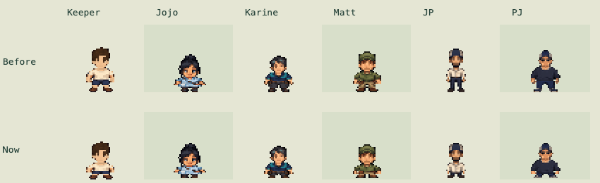
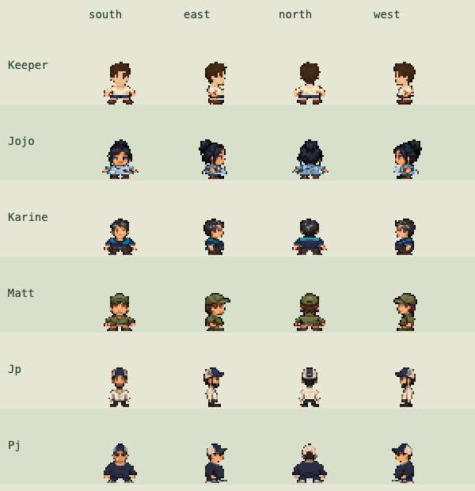

# Compact character pass · v0.102.1

Jojo and Karine provide the reference proportions for the keeper, Matt, JP and PJ.
All humans now have a six-pixel torso, a one-pixel exposed leg band and three-pixel
boots at map scale. Their existing heads retain the same size and pixels. Combat
uses the same proportions at its existing doubled display scale.

The renderer uses each NPC's own anatomical cuts: Jojo's apron stays in the body,
and JP's longer trousers no longer get included in the torso. Boot crops follow
the actual shoes. The original source sheets, faces, hair, hats, build widths,
equipment layers and ground anchors remain. The other player's synced appearance
inherits the keeper's proportions. JP's render offset keeps his face above the
standing counter, and the keeper's rear necklace band remains visible when small.

This is a render-only adjustment, with no new runtime artwork or download cost.
The existing pose/lighting caches and map collision are reused.

## Checks

39 Node tests pass. Browser comparisons verify identical head pixels in 68
directional/pose cases, unchanged keeper boot pixels in 48 cases, and visible
changes for all eight equipment slots in all four directions. Both hubs, walking,
combat, mobile layout and offline loading were checked in isolated test storage.

