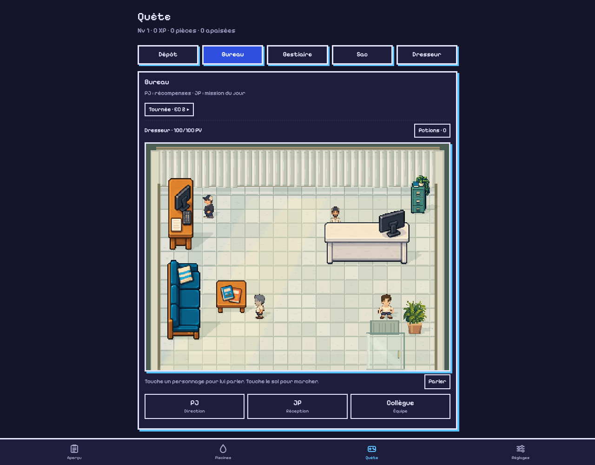
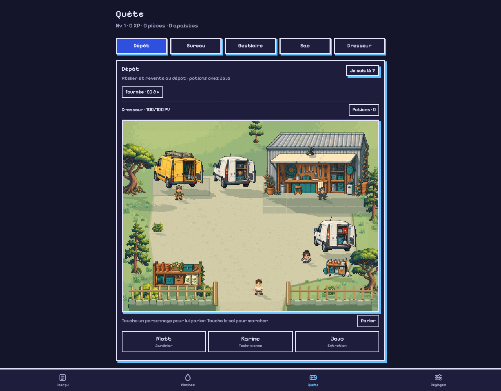
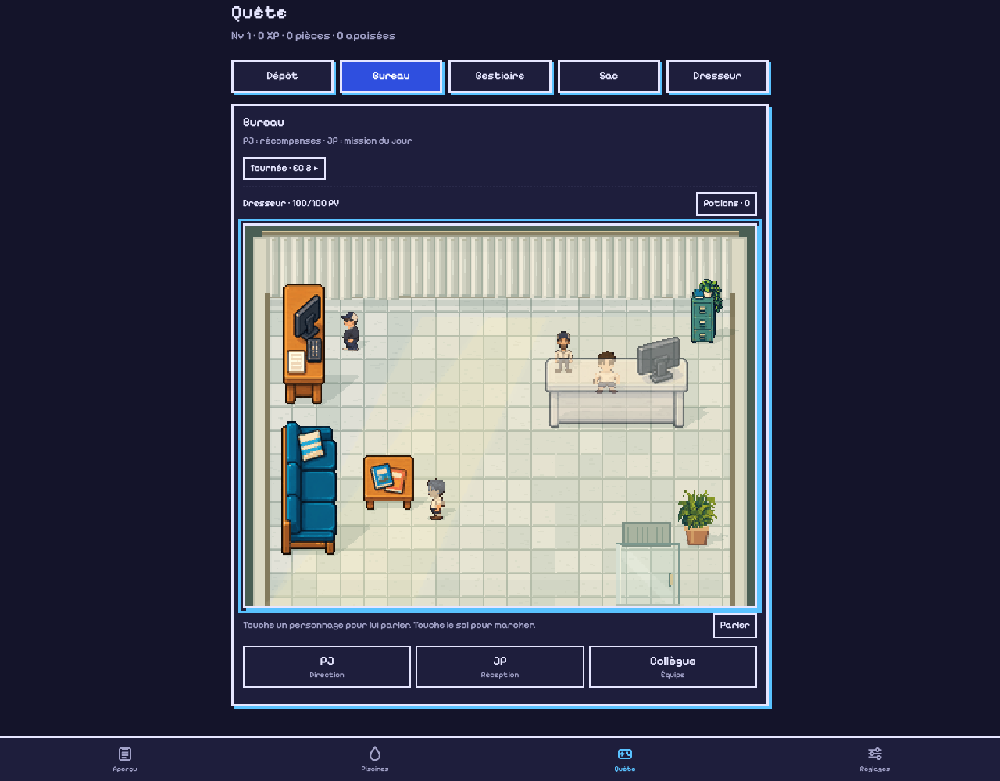

# Quest v0.101 · Layered hubs and character integration

For the latest character proportions, see [the regenerated native people](quest-people.md).

The Bureau is now a compact 384×288 room. At the same panel width, its characters
appear a third larger than on a 512×384 map. PJ faces a small vertical wooden
computer desk along the left wall. JP stands behind a taller white counter on
the right, with the computer offset to keep his face visible. The other player
is near the larger vertical sofa at bottom-left and its square magazine table.
Grey-white tiles and the full back-wall curtain remain. Light implies a full
glass frontage; its window frames are cut away, leaving a glass door at bottom-
right. The floor plan, NPC approaches, prop sizes and click coordinates are
calibrated to this room. Furniture fades when it would hide the keeper.

The 512×384 Dépôt uses separate garden, gravel, shadow, prop, actor and foreground
layers. Matt has a yellow gardener's van, Karine a white Kangoo with technician
equipment, and Jojo a white Kangoo with cleaning supplies. Clicking a van opens
its owner's existing action. Workshop, potion counter, storage rack, plant borders
and gate frame an open walkable courtyard. Matt's label is now “Fourgon”.

Two additional transparent cars are exported for later use: a black Renault
Scénic and a white Volkswagen Polo. They are not placed on a map or precached.
See [the art pack](../assets/quest-hubs/README.md) for every native PNG and prompt.

Only the leg segment is shortened another 50%; heads, torso height and boots keep
their dimensions. The keeper's torso has a small width increase. Original source
character images, individual equipment layers and foot anchors remain intact.
Cached sun/shade tints and directional silhouettes give actors the same light as
their surroundings. Small rooted grass blades overlap their soles on lawns.

Canvas input and context-menu positioning use each map's dimensions. The compact
Bureau, full-size Dépôt and 23 pool maps share the existing game actions and
maintenance handlers. NPC roles, rewards, GPS rules and appearance sync retain
their previous behavior.

## Verification

39 Node tests pass, including native atlas bounds, the 200 KB combined foliage/
hub download budget, all hub routes and approaches, smaller-room bounds, and
head/torso/boot geometry invariants. Syntax and diff checks pass.

Isolated browser QA verifies all six NPC hit targets, all three van actions,
the compact Bureau's exit and outside-menu dismissal, walking behind the counter,
walking onto the Dépôt's grass, and all 23 pool routes. A pixel comparison over
48 base/equipped directional idle/walk cases verifies that shortening the legs
preserves head and boot pixels. Maintenance logs remain unchanged by this QA.

Both hubs and their menus fit a 320px viewport. Cold offline loading works with
cache `lp-v0.101`; it includes native hub art and excludes full source images
and spare exports. No browser errors were observed.

A desktop Chromium Bureau walk produced 60 render updates/second, with sampled
average JavaScript drawing work of 0.38–0.81 ms during movement. This excludes
GPU composition and is not a physical-phone performance measurement. Static
surfaces/shadows are built once per stage and lit sprite variants are bounded.

Screenshots use isolated test state:

