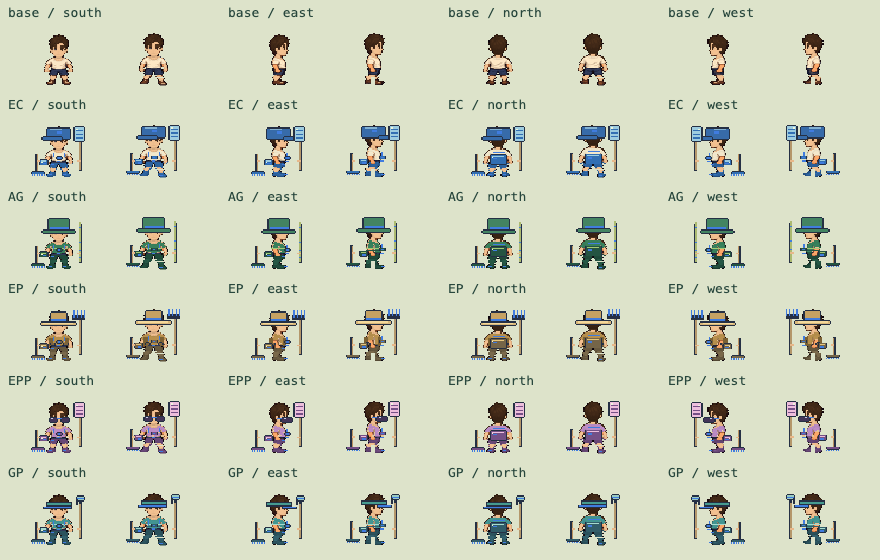
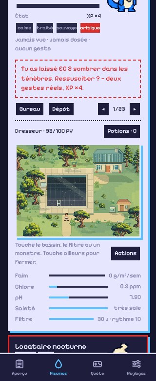

# Quest v0.100 · Living world

For the current hub artwork, vehicles and character proportions, see
[Quest v0.101](quest-hubs.md).

The existing characters and individual equipment layers now use the v5 study's
requested proportions: 80% overall display scale and 50% height below the neck.
The head is not compressed with the body. Original 48×64 art stays unchanged;
idle, walking and combat poses share the same foot anchor. NPCs use neck splits
that account for their different source heights. Full-set auras fit the smaller
silhouettes. Combat uses a closer view of the same characters in a garden clearing.

All 23 authored pool layouts now render with living-world scenery: coastal trees,
layered grass, warm paths, textured terraces, projected shadows, water caustics,
reflections and a gentle breeze. Pool water still reflects the real game condition,
including dirty and sunken pools. The player and monsters share the scenery's
depth order. Canopies become translucent when they obscure the player.

The existing map identities, collision grid, service anchors and maintenance
handlers remain in use. The deck can be crossed by tapping it; water opens the
pool actions. Buildings use visible sprite hit regions, foliage can be rustled,
and blocked ground taps choose the closest reachable cell. Arrow keys and WASD
walk; Enter opens actions. Outside taps and Escape close menus.

The Bureau and Dépôt retain their approved backgrounds and NPC roles, with the
same compact character proportions. Inventory, HP, rewards, quest progression
and appearance synchronization retain the v0.99 rules.

## Rendering budget

- Scene remains 512×384, over the existing 16×12 logical navigation grid.
- The 2.4 MB foliage source is packed into a 49,278-byte runtime atlas; the
  original is excluded from offline downloads.
- Each active pool scene caches its ground and projected shadows once. Grass
  and canopy sway reuse five shared integer-pixel poses. Static building sprites
  are shared. The combat backdrop is cached once.
- The existing active 60 fps / economy 30 fps scheduling remains, with slower
  idle rendering and offscreen/hidden-tab pauses.

An EC-2 walking sample in desktop Chromium delivered 60 render updates/second.
Sampled average JavaScript drawing work was 0.35–0.83 ms. This excludes GPU
composition and is not a physical-phone performance claim.

## Verification

36 Node tests pass. New checks cover deterministic decoration without modifying
routes or interaction anchors, reachable fallback destinations (including isolated
open cells), and compact offline asset coverage. Existing game-rule, animation,
equipment, migration and appearance-sync checks also pass.

Browser checks in isolated local storage covered all 23 live map routes, cached
background reuse, pool-menu/outside dismissal, a long walk, JP's map hit target,
all five equipped sets plus base wear in four directions and idle/walk poses,
320px and 390px layouts, and a cold offline pool reload. A double-clicked combat
action still resolves one turn: enemy HP remains unchanged immediately, damage
arrives during the action, then the enemy responds. No browser errors were seen.
Walking, menus and combat left the maintenance visit/reading arrays unchanged.

Screenshots use isolated test state. The dark pool is the game's sunken condition
for a pool without recorded maintenance, not a replacement for its water palette.

