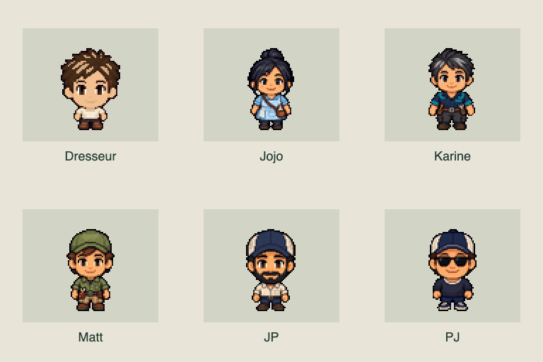
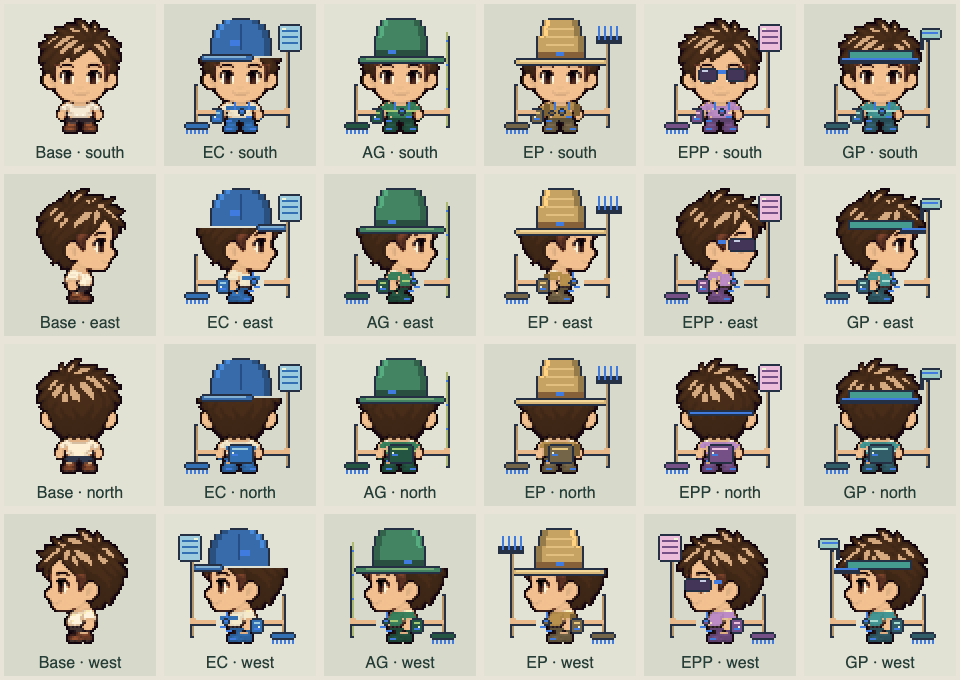
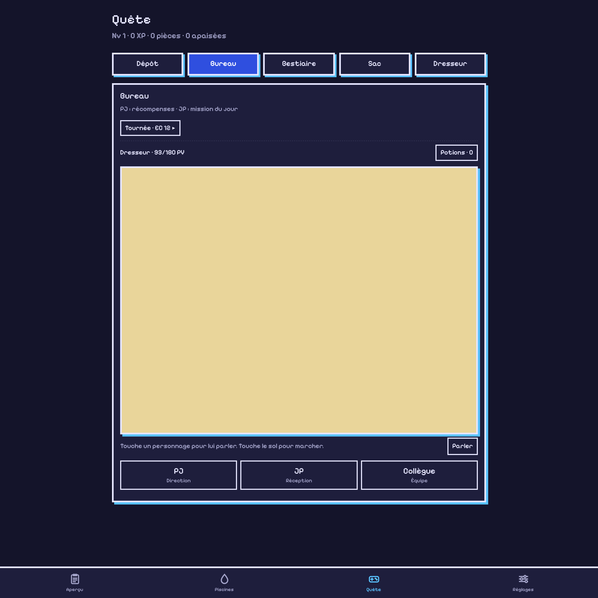
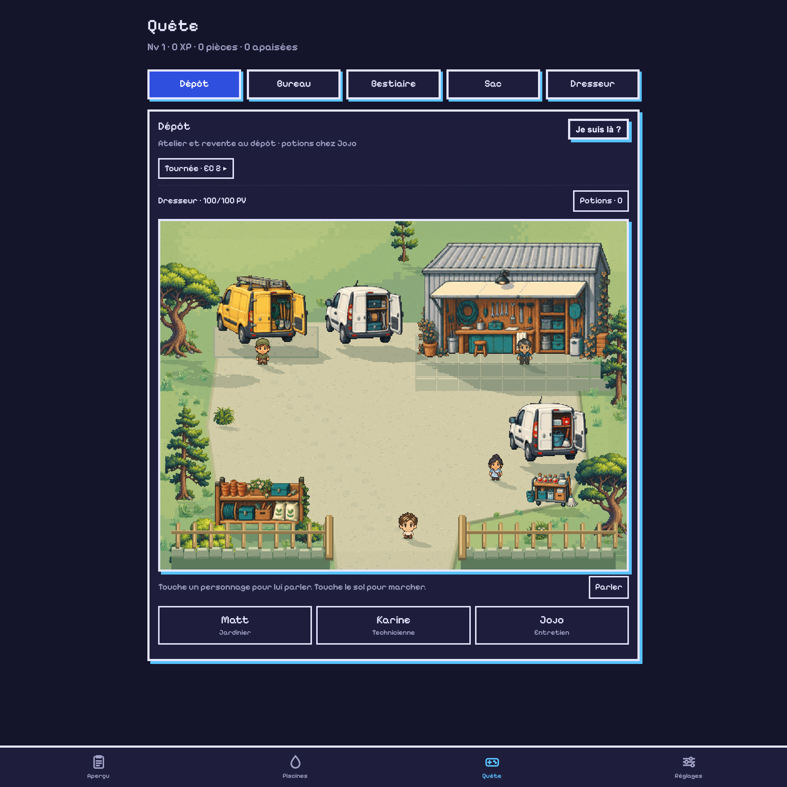

# Regenerated compact people · v0.103.0

The keeper and five NPCs are redrawn with full heads, short rounded torsos and
almost no exposed legs. Each direction is a whole 64×64 transparent sprite.
The art occupies roughly the previous map footprint; the extra source pixels
provide detail on dense displays. Jojo/Karine's compact proportions guide the
cast, with each person's hair, clothes, glasses and job identity retained.

The previous runtime compression split bodies into differently scaled bands.
This build draws the regenerated people intact. Idle bob, cast lean and walking
bounce translate the whole texture. Small boot steps remain separate, while
face pixels stay unchanged. Eight independently equipped pieces are fitted to
the new body; hats cover the underlying hair, and mixed sets, rarity details,
curses, appearance sync and full-set auras keep working.

Maps and portraits now use a backing canvas sized to their CSS content area and
device pixel ratio, capped at 3. Logical map size stays 192×144 for the Bureau
and 256×192 for the Dépôt/pools. Clicks and popup placement use those logical
dimensions rather than the backing canvas. A 652×487.5 CSS-pixel map uses a
1304×975 buffer at DPR 2; a 252×187.5 phone panel uses 756×563 at DPR 3.

Nearest-neighbour sampling can still change at fractional canvas transforms.
Sprites are therefore sampled once at their final physical size, then copied
at integer physical positions. The cache is bounded to 192 frames and 8 MiB.
Idle maps still draw at 12 fps, active maps target 60 fps (30 in economy mode),
and offscreen stages pause. Low-DPI displays remain limited by their physical
pixel count; increasing source resolution cannot create extra screen pixels.

The new atlas is 105,767 bytes and decodes to 512 KiB. Original generated sheets
and individual exports are preserved outside the offline precache. The selected
art was created with the built-in ImageGen tool; exact prompts and reproducible
packing instructions are in [the asset pack](../assets/quest-people/README.md).

## Verification

45 Node tests pass, with syntax and diff checks. Isolated Chromium checks cover:

- 24 directional views; visible changes for 960 set/rarity/slot/view combinations.
- Identical face pixels in 208 animated poses and 512 physical samples across
  four fractional display scales, including movement and bobbing.
- All six NPC hit targets, popup bounds and outside dismissal at DPR 1, 2 and 3;
  the DPR 3 run uses a 320px viewport. All 23 pool routes and basin menus work.
- Walking, portrait resize (144×144 to 288×288 at DPR 2), equipment and combat.
  The tested attack stayed at 180 HP before impact, then reached 168 HP after
  one resolved turn; actions were locked while it played. Maintenance logs
  were unchanged by the game-only checks.
- Offline reload with cache `lp-v0.103.0`: all 24 native views and the living
  map render, with no source images downloaded. No runtime browser errors.

The [art regression check](quest-people/verify-art.js) can be run in a loaded
Pixel-theme test tab using `agent-browser eval --stdin`. It uses detached
canvases and leaves saves/logs unchanged.

A desktop walk sampled 60-fps scheduling and 0.49–0.82 ms average JavaScript
drawing work. This excludes GPU composition and is not a physical-phone test.
See [verification.json](quest-people/verification.json) for measured results.

