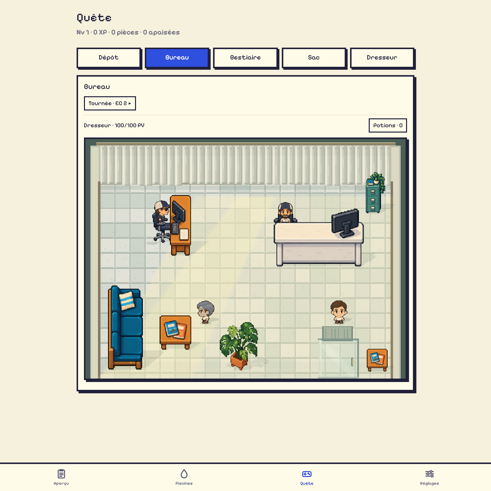
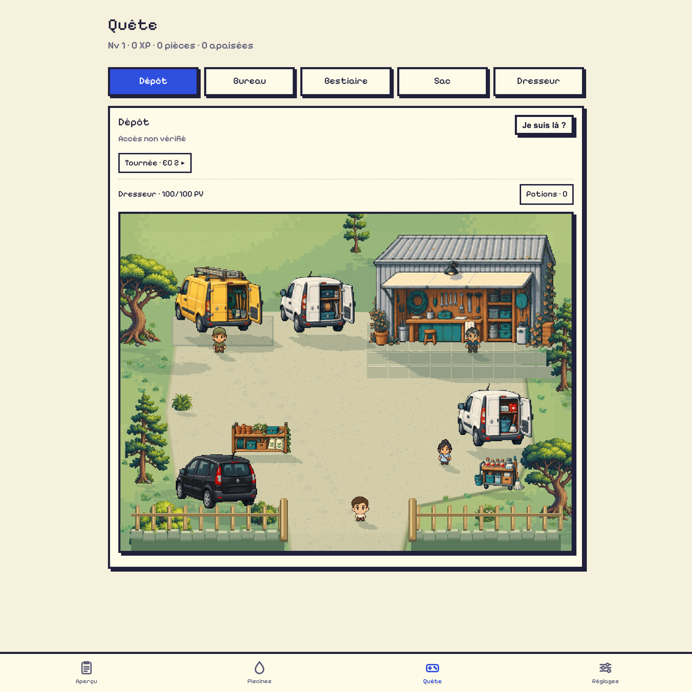
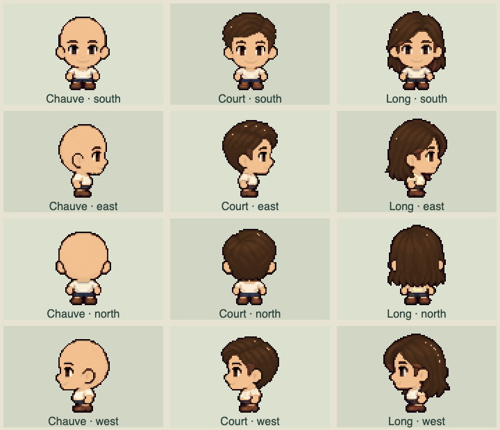
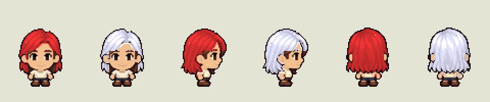

# Quest v0.104.1 · Inventory, hub life and rematches

Equipment operations now resolve the item's ID when clicked. A swap replaces
the selected bag entry with the previously worn piece, preserving the full
inventory even in a full bag. Repeated clicks, reordered bags and stale sheets
cannot remove another item. Older missing/duplicate IDs are repaired without
discarding entries. All overflow entries are displayed. Equipment sales are
available through Matt on the Dépôt map.

The black Scénic is parked at the bottom-left of the Dépôt. Its 200-coin option
opens Matt's sales and Karine's crafting remotely for the current map visit.
It charges once, survives a reload, and expires when leaving the Dépôt map.
GPS access remains free; the pass does not change real-world location data.

The Bureau has a full back curtain and stronger sunlight from the glass front.
PJ sits to the left of the smaller mirrored wooden desk. His seated artwork is
raised by one floor tile; both PJ and JP have chairs and stand/sit transitions.
The sofa and coffee table sit lower, with a broad-leaf indoor plant near the
front and a small brochure table at bottom-right. Both hub pages end at the
map: NPC panels, footer instructions and duplicate workshop controls are gone.
NPC actions use map taps; keyboard users can press Enter on the canvas.

All six NPCs have local walking routines and return points. PJ/JP return to
their seats. Characters avoid furniture, each other and the player's planned
path, and pause when their dialogue opens. Reduced motion pauses autonomous
movement. Counterpart-player position is cosmetic; only their appearance is
synced, as before. Ambient walking targets 30 fps, player actions up to 60 fps.

## Defeat rules

- A defeat costs 20% of coins (minimum 10, capped at the wallet) and 10% XP.
- On the first defeat, there is a 20% chance that one unequipped bag item is
  held by that monster. Crates and worn equipment are excluded.
- The monster returns to full HP and allows one rematch. Winning restores the
  held item, lost coins and XP, in addition to ordinary rewards and drops.
- Failing or abandoning the second combat makes the monster and held property
  disappear permanently. It cannot start a third combat. Merely leaving the
  pool after the first resolved defeat keeps the rematch available.
- Recovered equipment may overflow a full bag; it remains visible and owned.
  New collections wait for room. Damage and penalties still resolve at impact.

Rules and the remaining attempt are shown in the monster's map menu. They are
game-only changes; maintenance handlers and logs are unchanged.

## Art and living world

The keeper now has distinct bald, short and long styles in all four directions,
with hair/skin colours, independently equipped pieces and stable face sampling.
New hair, chairs and the indoor plant were created with built-in ImageGen.

- [Hair exports and exact prompts](../assets/quest-hair/README.md)
- [Chair prompt and reference](../assets/quest-hubs/chairs-generation.json)
- [Indoor plant prompt and reference](../assets/quest-hubs/room-generation.json)
- [Hub atlas](../assets/quest-hubs/manifest.json)

The Pixel Lab v5 visual features are adapted into the runtime: latest cached
Aperçu weather, Paris daylight, wind-driven foliage/water, cloud/temperature/UV
lighting, outdoor rain, residence-weighted tree species, connected grass cover,
weekly growth, spring-back after passage and fading tracks. Canopies and their
projected shadows share cached poses. The five tree preferences and 70% quota
come from the study. Grass uses illustrative per-pool weekly offsets; these
are not fabricated gardener visits or maintenance schedules.

The [tree source and original prompt](../assets/quest-world/source/tree-species-prompt.txt)
are preserved with the native `trees.png`/`trees.json` export. Sources are excluded
from service-worker downloads. The additional/revised PNG download is about
195 KB over v0.103. All runtime atlases decode to 14.5 MiB; display, pose and
lighting caches are additional, with the physical sprite cache capped at 8 MiB.

## Verification

60 Node tests pass, including inventory conservation, reload-safe rematches,
permanent second-loss behavior, full-bag recovery, pass charging, NPC return
routes and collision, weather bounds, tree quotas, grass recovery and native
asset budgets. Syntax and diff checks pass.

Isolated browser checks cover repeated/stale hat swaps, visible overflow,
Matt-only sales, one pass charge/reload/expiry, crafting inside the map menu,
all hairstyle controls, six moving NPC hit targets and conversation pauses,
keyboard/outside dismissal, desktop and 320px layouts, and all 23 pool menus.
The combat run verifies timed damage, recovery plus ordinary drops, then a
second defeat with permanent item loss. Maintenance logs stay unchanged.
Offline reload loads the new code/art with cache `lp-v0.104.1`, without source
images. The earlier pixel regression check still covers 960 equipment cases,
208 head poses and 512 physical samples. Browser testing uses emulation and
does not replace testing on a physical phone.

Measured results: [verification.json](quest-v104/verification.json).

