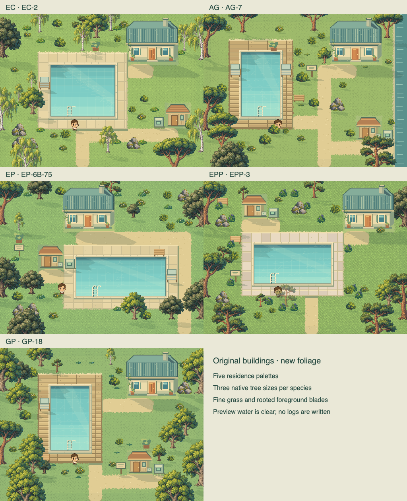
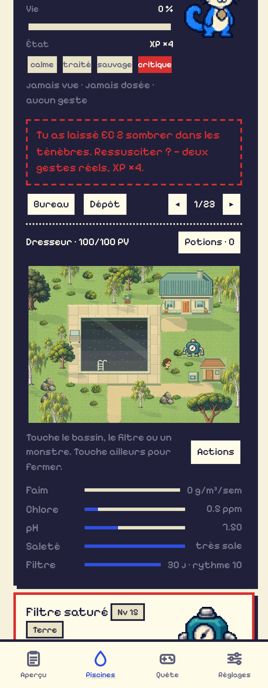

# Quest v0.105.0 · Native foliage and continuous lawn

The 23 pool maps now use the supplied Pixel Lab v5 trees and fine grass.
The original house and filter-shelter drawings retain their previous scale,
front-facing perspective, doors and action targets. Bureau and Dépôt keep
their existing artwork and layout.

| Residence | Preferred species | Lawn palette |
| --- | --- | --- |
| EC | Birch | Sunny meadow |
| AG | Umbrella pine | Coastal blades |
| EP | Holm oak | Clover lawn |
| EPP | Maritime pine | Woodland flowers |
| GP | Oak | Forest fringe |

The existing 70% residence species quota now selects separately drawn small,
medium and large trees. Native pixels and bottom anchors are preserved.
The lawn is continuous, with six fine blade roots per 8-pixel cell, a narrow
dithered path/terrace boundary, wind and brief spring-back after walking.
Small pots and signs sit within the lawn without rectangular bare patches.
Foreground blades cover only the lower body; detailed clumps are sparse accents.

The ground exports use the simulator's original maximum blade height. The
live renderer caps it at eight world pixels for the compact keeper. Base
texture and animated blades are separate, avoiding doubled grass. Weekly
visual growth and weather remain cosmetic and never write maintenance logs.

## Assets and budget

- [Native files, source prompts and reproducible packing](../assets/quest-zones/README.md)
- [Runtime manifest](../assets/quest-zones/manifest.json): 45 packed assets; ten
  alternative building exports retained as references outside the runtime atlas.
- Atlas: 92,726 bytes PNG / 790,528 decoded bytes. Compared with v0.104.1's
  tree atlas, the PNG download shrinks by 31,823 bytes.
- All runtime atlases decode to 15,432,116 bytes (14.72 MiB), excluding canvas,
  lighting and pose caches. The existing physical sprite cache stays capped
  at 8 MiB. Meadow sprites add a bounded cache of at most 1.97 MiB per scene.
- The full-field grass layer refreshes at 8 Hz for wind, or when nearby grass
  memory changes; the renderer reuses it on other frames.
- Native/source files are excluded from offline downloads. Cache version:
  `lp-v0.105.0`.

## Verification

65 Node tests pass. Syntax and diff checks pass. The atlas builder verifies
that every packed RGBA rectangle exactly matches its native source. Browser
checks verify all 15 ground tile exports and the original house/shelter pixels
in all five residence previews.

All 23 pool maps retain working house, filter-shelter and basin menus without
changing maintenance logs. An isolated 320px / DPR 3 browser walk crosses six
cells into the grass; popups fit and close on an outside tap. All six hub NPC
menus, conversation pauses, keyboard access and absence of duplicate footers
also pass. Offline reload loads all 45 runtime regions without source images
or the superseded tree atlas.

The walking sample reports 1.13–1.93 ms per draw at the 60 fps target on this
machine under mobile emulation. This is not a physical-phone benchmark.
Detached scene checks verify grass displacement and recovery, the foreground
pixel band, and the bounded frame cache. No uncaught browser errors occurred.

[Measured verification](quest-zones/verification.json).

The overview below renders the actual scene code with clear preview water;
it does not represent saved maintenance state or create logs.

The mobile screenshot uses an untouched maintenance fixture, so its basin is
in the critical state.

